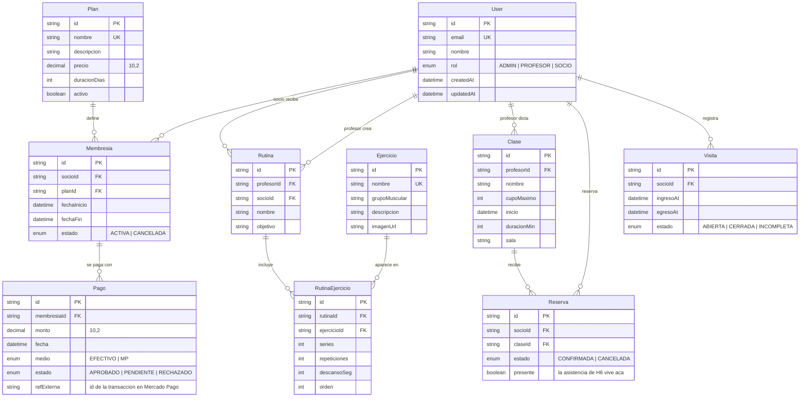

# Diagrama entidad-relación

Modelo de datos del gimnasio, generado a partir de `prisma/schema.prisma`. Si el
schema cambia, este diagrama se actualiza en el mismo PR.

`Socio` y `Profesor` no son tablas: son el mismo `User` diferenciado por su
campo `rol` (spec §3). Por eso `User` aparece en varias relaciones con etiquetas
distintas según el rol con el que participa.

## Relaciones N-N

Las dos N-N del requisito de la cátedra se resuelven con una entidad puente que
lleva sus propios atributos:

| N-N | Puente | Qué atributos propios tiene |
|---|---|---|
| Rutina ↔ Ejercicio | `RutinaEjercicio` | `series`, `repeticiones`, `descansoSeg`, `orden` |
| Socio ↔ Clase | `Reserva` | `estado`, `presente` (la asistencia) |

## Restricciones que el diagrama no muestra

**Unicidad simple:** `User.email`, `Plan.nombre`, `Ejercicio.nombre`, y
`RutinaEjercicio (rutinaId, ejercicioId)` — un ejercicio no se repite dos veces
en la misma rutina.

**Índices únicos parciales** (SQL a mano en la migración, Prisma no los
expresa). Son reglas de negocio, no detalles de implementación:

- `Reserva (socioId, claseId) WHERE estado = 'CONFIRMADA'` — un socio no repite
  una clase, pero **sí puede volver a reservar después de cancelar**. Un
  `@@unique` simple rompería el flujo de cancelación de la spec §6.
- `Visita (socioId) WHERE estado = 'ABIERTA'` — una sola visita abierta por
  socio, que es lo que asume el flujo del QR.

**Borrado:** `onDelete: Restrict` en todo lo que es historial de negocio
(membresías, pagos, visitas, reservas, rutinas, clases): no se borra un socio
con historial. La única cascada es `RutinaEjercicio → Rutina`, porque un ítem de
rutina no tiene sentido sin su rutina.

## Datos que NO están en el modelo a propósito

Dos cosas que alguien podría esperar como columna y se calculan al leer. Es el
criterio de la clase 3: *si el dato puede cambiar sin que nadie toque el
sistema, se calcula; guardarlo es guardar una mentira con fecha de vencimiento.*

| Dato | Por qué no se guarda | Dónde se calcula |
|---|---|---|
| `VENCIDA` como estado de la membresía | Se vence sola cuando pasa `fechaFin`, sin que nadie abra la app. Guardarla exigiría un proceso que recorra la tabla corrigiéndola, y hasta que corra la columna miente | `estadoMembresiaVista()` en `lib/membresia.ts` — [ADR 0002](adr/0002-estado-membresia.md) |
| `duracionMin` de la visita | Es `egresoAt - ingresoAt`. Si un admin corrige el egreso a mano, una duración guardada queda mintiendo | `calcularDuracionMin()` en `lib/visita.ts` — [ADR 0003](adr/0003-duracion-visita.md) |

Las membresías `CANCELADA` y las reservas/visitas con su estado **sí** se
guardan: son hechos que alguien realizó, no conclusiones del paso del tiempo.
